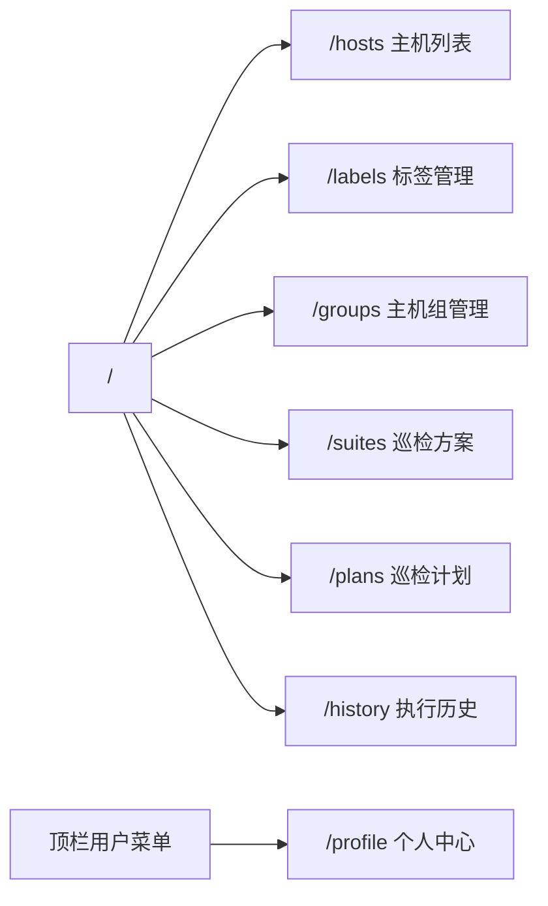
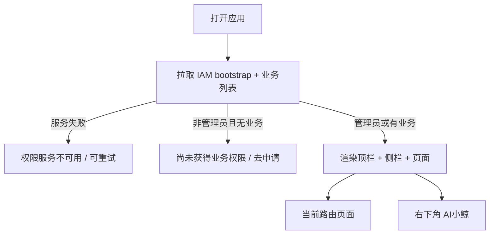
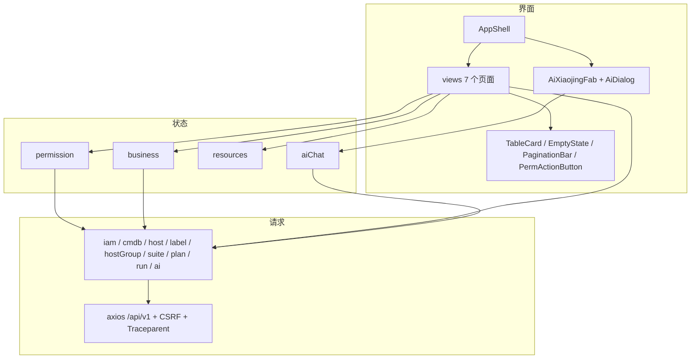
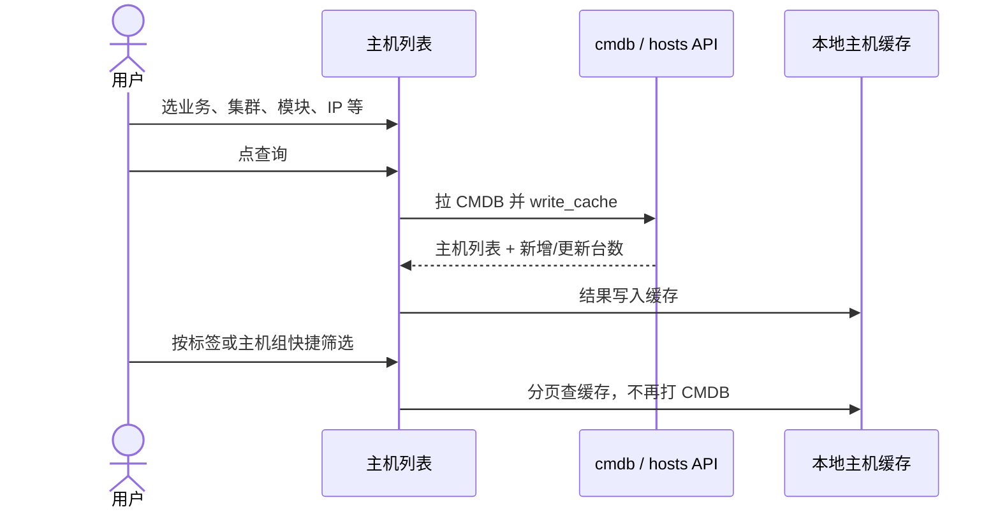
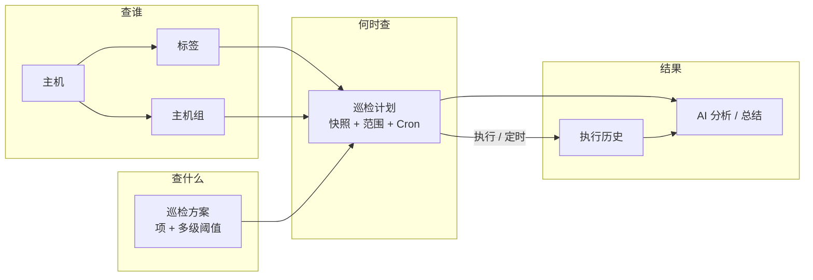
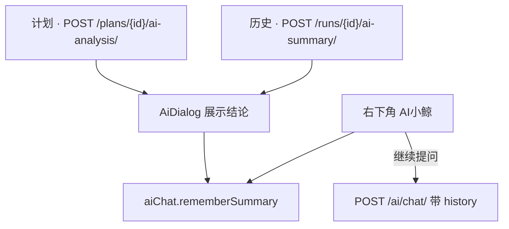
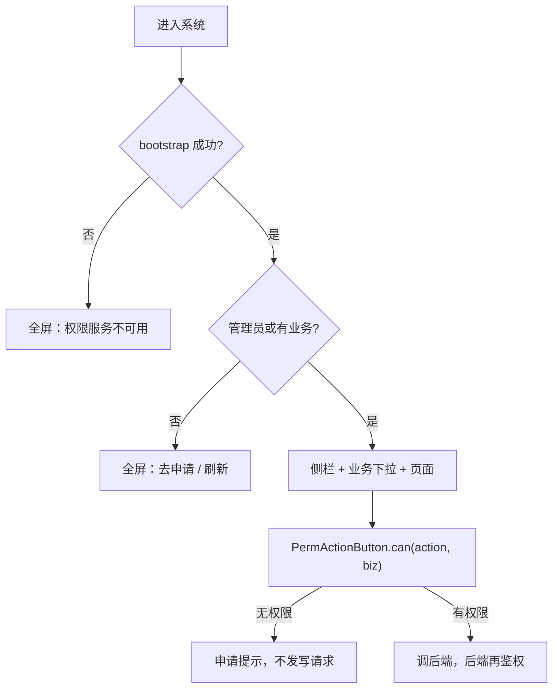

# 蓝鲸主机巡检平台 · 前端作品集

对照 `frontend/src` 的路由、布局和页面整理。技术栈：Vue 3 + Vue Router + Pinia + bkui-vue，请求走 `/api/v1`，开发时由 webpack 代理到 Django。

可交互版本：同目录 [frontend-portfolio.html](./frontend-portfolio.html)（浏览器打开，需联网加载 mermaid）。

---

## 1. 信息架构

侧栏 6 个业务页 + 顶栏进入的个人中心（不出现在导航）。进入应用后默认跳到主机列表。



**讲解：** 前三页管「查谁」——主机、标签、主机组；中间两页管「查什么、何时查」——方案和计划；执行历史看结果，并提供 AI 总结。个人中心只处理账号、已有业务和权限申请，所以路由上标了 `hideInNav: true`。

---

## 2. 页面骨架

全局布局在 `AppShell.vue`：顶栏选业务、侧栏切页面、主区按权限决定是空态还是内容。有业务权限时右下角挂「AI小鲸」。

```text
┌─────────────────────────────────────────────────────────┐
│  BK 蓝鲸主机巡检平台  │ 当前业务 [下拉]  │ 角色  用户名 ▼ │
├──────────┬──────────────────────────────────────────────┤
│ 主机列表  │ 页头：标题 + 说明 + 当前业务提示              │
│ 标签管理  │                                              │
│ 主机组    │              <router-view />                 │
│ 巡检方案  │                                              │
│ 巡检计划  │                                              │
│ 执行历史  │                                    [AI小鲸]  │
│ 收起菜单  │                                              │
└──────────┴──────────────────────────────────────────────┘
```



**讲解：** 按钮显隐只是体验层，`store/permission.js` 写明前端 `can()` 不是安全边界，写操作仍由后端 IAM 再判一次。无权限点按钮会走申请提示，而不是静默消失让人找不到入口。

---

## 3. 模块怎么拼



**讲解：** 页面不直接拼 axios。业务、权限、标签组缓存分三个 store；HTTP 按资源拆模块。每个请求带 CSRF 和 `Traceparent`，方便和蓝鲸 APM 对上同一条调用链。

---

## 4. 主机列表：查询即缓存



**讲解：** 条件区查的是 CMDB；标签 / 主机组快捷筛选走缓存，避免每次筛选都打配置平台。列表上可以打标、入组、批量操作，这些数据后面会被计划的「目标范围」用到。

---

## 5. 巡检主路径



**讲解：**

| 页面 | 用户在做什么 |
|---|---|
| 标签 / 主机组 | 给主机分类，供计划按组或按标签圈范围 |
| 巡检方案 | 组合巡检项、阈值、参数；计划创建时打成快照 |
| 巡检计划 | 选方案、范围（主机组 / 标签 / CMDB 筛选）、频率；可执行、预览、同步方案、AI 分析 |
| 执行历史 | 按状态 / 触发方式筛选；看每台主机明细；可重跑、AI 总结 |

计划创建后改原方案不会自动覆盖已有计划，必须点「同步方案」。覆盖主机数带「动态」标记，因为范围是运行时解析的，不是写死的主机 ID 列表。

---

## 6. AI 怎么嵌进页面



**讲解：** 小鲸不是从零闲聊。先在计划或历史上生成一次总结，面板里才能基于上次结果追问。Markdown 会拆成标题、段落和表格。AI 只读建议，执行仍要人点「执行 / 重跑」，并过 `execute_plan` 权限。

---

## 7. 权限在界面上的三道闸



个人中心展示用户名、角色、已授权业务，以及申请链接。顶栏角色文案：系统管理员 / 业务运维 / 只读用户 / 无业务权限。

---

## 8. 路由一览

| 路径 | 页面 | 一句话 |
|---|---|---|
| `/hosts` | HostList | CMDB 查询写入缓存，再按标签/组筛选、打标入组 |
| `/labels` | LabelManagement | 业务标签 CRUD，可跳转查看关联主机 |
| `/groups` | HostGroupManagement | 主机组 CRUD，查看组内主机 |
| `/suites` | SuiteManagement | 方案 + 巡检项与多级阈值 |
| `/plans` | PlanManagement | 计划、执行、预览、同步快照、AI 分析 |
| `/history` | RunHistory | 执行记录、明细、重跑、AI 总结 |
| `/profile` | Profile | 账号与权限申请 |

列表页同一套交互：`TableCard` + 搜索刷新 + `PermActionButton` + `EmptyState` + `PaginationBar`。
